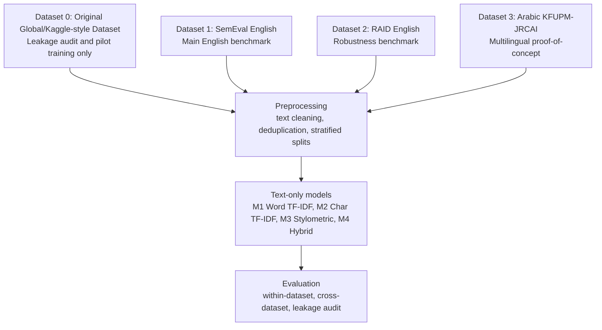

# Beyond Accuracy: Leakage-Aware and Cross-Dataset AI-Generated Text Detection

Leakage-aware research pipeline for binary AI-generated content detection.

This project performs leakage-aware and cross-dataset AI-generated text detection using lexical, character-level, stylometric, and hybrid features. The original dataset is used as a leakage-audit case study, while SemEval and RAID are used for final English evaluation and Arabic is included as a proof-of-concept.

## Research Questions

1. Which model performs best within each English benchmark?
2. Which dataset gives better generalization?
3. Does a detector trained on one dataset generalize to another?
4. Can the same lexical/stylometric approach extend to Arabic?
5. Why can high in-domain scores on a leaked dataset be misleading?

## Initial Dataset Audit

The project originally began with the Global AI vs Human Content Dataset 2026 stored in `old/ai_vs_human_content_v2_20000.csv`. A leakage audit showed that this dataset contains label-revealing metadata, explicit `AI-generated` markers inside generated rows, and duplicated or conflicting normalized samples. Metadata fields such as `source` and `ai_model` are strongly label-correlated and therefore cannot be used as model features.

For this reason, the original dataset is kept as `Dataset 0`: a leakage-audit and pilot-training case study. It is not treated as the main final benchmark. The final English experiments use SemEval-2024 Task 8 Subtask A and RAID, while the Arabic dataset is reported as a proof-of-concept extension.

## Datasets

Raw downloads are stored under `data/raw/` and are never overwritten by preprocessing. Cleaned files are written to `data/processed/`, and train/test splits are written to `data/splits/`.

| Dataset | Role | Language | Local Path | Notes |
| --- | --- | --- | --- | --- |
| SemEval-2024 Task 8 Subtask A | Main dataset A | English | `data/processed/semeval_english_clean.csv` | Binary human vs AI text detection |
| RAID | Main dataset B / robustness dataset | English | `data/processed/raid_english_clean.csv` | Balanced subset from RAID train split |
| Previous project dataset | Dataset 0 / leakage audit only | English/code | `data/processed/old_ai_clean.csv` | Pilot benchmark used to show leakage and poor transfer |
| KFUPM Arabic Generated Text | Arabic POC | Arabic | `data/processed/arabic_poc_clean.csv` | Original Arabic text vs generated Arabic text |

Preparation keeps punctuation and casing for stylometric analysis. Metadata such as `generator`, `domain`, `attack`, `decoding`, `source_file`, and `dataset_name` is preserved for analysis only and is not used as model input.

## Models

- `M1_Word_TFIDF_LogReg`: word TF-IDF unigrams/bigrams + Logistic Regression
- `M2_Char_TFIDF_LinearSVM`: character TF-IDF 3-5 grams + Linear SVM
- `M3_Stylometric_RandomForest`: handcrafted stylometric features + Random Forest
- `M4_Hybrid_TFIDF_Stylometric`: word TF-IDF + character TF-IDF + stylometric features + Linear SVM

Metadata such as `generator`, `attack`, `domain`, `source`, `prompt`, and `dataset_name` is never used as model input.

## Architecture



The prediction pipeline uses only text-derived features. Dataset metadata is retained for reporting and error analysis, not for inference.

## Directory Structure

```text
NLP_Project/
├── app.py
├── README.md
├── requirements.txt
├── data/
│   ├── raw/
│   │   ├── semeval/
│   │   ├── raid/
│   │   └── arabic/
│   ├── processed/
│   └── splits/
├── notebooks/
├── src/
├── outputs/
│   ├── models/
│   ├── results/
│   ├── figures/
│   └── reports/
├── streamlit_app/
└── old/
```

`old/` contains the previous project version and is kept only for reference.

## How To Run

Install dependencies:

```bash
python3 -m pip install -r requirements.txt
```

`raid-bench` was tested and logged, but is not installed by default because the current package path forces old `numpy`/`scikit-learn` builds on Python 3.14. RAID is downloaded through Hugging Face `datasets` instead, and the failure note is preserved in `outputs/reports/dataset_download_log.md`.

Download supported public datasets when possible:

```bash
python3 scripts/download_datasets.py
```

If downloads fail because of Google Drive or Hugging Face access, manually put raw files in:

```text
data/raw/semeval/
data/raw/raid/
data/raw/arabic/
```

Current known caveat: SemEval Google Drive may time out with `gdown`. If that happens, manually download official SemEval-2024 Task 8 Subtask A into `data/raw/semeval/`, then run:

```bash
python3 scripts/prepare_semeval.py
python3 scripts/02_make_splits.py
```

Prepare clean datasets:

```bash
python3 scripts/01_prepare_datasets.py --arabic-skip-hf
```

If you want to stream RAID from Hugging Face when a local RAID file is unavailable:

```bash
python3 scripts/01_prepare_datasets.py --raid-allow-hf-fallback --raid-max-human 10000 --raid-max-ai 10000
```

Run individual dataset preparation steps:

```bash
python3 scripts/prepare_semeval.py
python3 scripts/prepare_raid.py --max-human 10000 --max-ai 10000
python3 scripts/prepare_old_dataset.py
python3 scripts/prepare_arabic.py --include-social
```

Create train/test splits:

```bash
python3 scripts/02_make_splits.py
```

Run within-dataset experiments:

```bash
python3 scripts/03_run_english_experiments.py --dataset semeval
python3 scripts/03_run_english_experiments.py --dataset raid
python3 scripts/03_run_english_experiments.py --dataset old_ai
```

Run cross-dataset evaluation:

```bash
python3 scripts/04_cross_dataset_evaluation.py
python3 scripts/07_old_dataset_comparison.py
```

Run Arabic POC:

```bash
python3 scripts/05_arabic_poc.py
```

Build final tables:

```bash
python3 scripts/06_build_reports.py
```

Run the app after models are saved:

```bash
streamlit run app.py
```

## Outputs

- `outputs/results/semeval_results.csv`
- `outputs/results/raid_results.csv`
- `outputs/results/old_ai_results.csv`
- `outputs/results/cross_dataset_results.csv`
- `outputs/results/old_cross_dataset_results.csv`
- `outputs/results/arabic_poc_results.csv`
- `outputs/figures/confusion_matrices/`
- `outputs/figures/comparison_plots/`
- `outputs/figures/feature_importance/`
- `outputs/reports/dataset_download_log.md`
- `outputs/reports/semeval_dataset_summary.md`
- `outputs/reports/raid_dataset_summary.md`
- `outputs/reports/arabic_dataset_summary.md`
- `outputs/reports/experiment_summary.md`

## Final Research Claim

This project performs leakage-aware and cross-dataset AI-generated text detection using lexical, character-level, stylometric, and hybrid features. The original dataset is used as a leakage-audit case study, while SemEval and RAID are used for final English evaluation and Arabic is included as a proof-of-concept.
